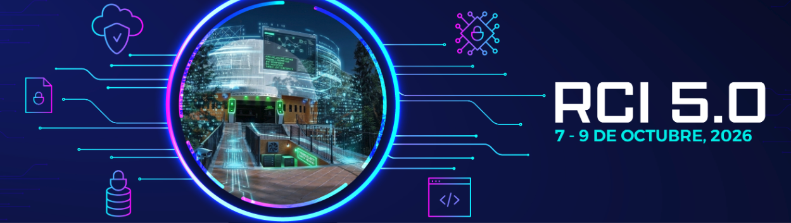

<p align="center">
  
  &nbsp;&nbsp;&nbsp;&nbsp;&nbsp;
  
</p>

<h1 align="center">Desarrollo de Contratos Inteligentes y Aplicaciones Descentralizadas</h1>

<p align="center">
  <strong>Material práctico del tutorial</strong><br>
  Quinta Reunión de Ciberseguridad para la Industria 5.0 (RCI 5.0)<br>
  Instituto Nacional de Astrofísica, Óptica y Electrónica (INAOE)<br>
  <strong>Miércoles 7 de octubre de 2026</strong>
</p>

<p align="center">
  <strong>Instructores</strong><br>
  Israel Jaudy Pérez Bermúdez<br>
  Armando Rivera Castillo
</p>

<p align="center">
  <a href="https://app.remix.live/#url=https://github.com/NullAstra404/rci5-contratos-inteligentes/blob/main/contracts/RegistroDocumentos.sol">
    
  </a>
</p>

<p align="center">
  
</p>

---

## 🚀 Acceso rápido

### Opción 1 — Abrir directamente en Remix IDE

Usa el botón **Abrir en Remix IDE** de la cabecera. El contrato `RegistroDocumentos.sol` se cargará automáticamente en un workspace de Remix.

> Si el archivo se abre en un workspace temporal de Remix, renombra el workspace si deseas conservar tus cambios.

### Opción 2 — Clonar el repositorio desde Remix

En **Remix IDE → Clone repository**, utiliza:

```text
https://github.com/NullAstra404/rci5-contratos-inteligentes.git
```

---

## 🎯 Objetivo del tutorial

Desarrollar, desplegar e interactuar con un contrato inteligente funcional utilizando **Solidity** y **Remix IDE**, comprendiendo los elementos básicos de una aplicación descentralizada.

El caso práctico consiste en un sistema sencillo de **registro y verificación descentralizada de documentos**.

---

## 🧩 Conceptos utilizados

Durante la práctica se trabajará con:

- `struct`
- `mapping`
- `address`
- `msg.sender`
- `require`
- `block.timestamp`
- funciones `view` y `pure`
- eventos
- transacciones
- gas
- Remix VM

---

## 📁 Estructura del repositorio

```text
rci5-contratos-inteligentes/
├── assets/
│   ├── Logo INAOE.jpg
│   ├── MCTS Logo.png
│   ├── Logo SECIHTI.png
│   └── RCI.png
├── contracts/
│   ├── RegistroDocumentos.sol
│   └── RegistroDocumentosBase.sol
├── docs/
│   └── GUIA_PRACTICA.md
├── README.md
└── LICENSE
```

### `contracts/RegistroDocumentos.sol`

Contrato completo y funcional utilizado durante la práctica.

### `contracts/RegistroDocumentosBase.sol`

Plantilla mínima para quienes quieran reconstruir el contrato paso a paso.

### `docs/GUIA_PRACTICA.md`

Guía rápida para compilar, desplegar y probar el contrato en Remix IDE.

---

## 🧪 Flujo de la práctica

1. Abrir el contrato en Remix IDE.
2. Compilar `RegistroDocumentos.sol`.
3. Desplegarlo en **Remix VM**.
4. Generar un hash con `calcularHash()`.
5. Registrar el documento desde la **Cuenta A**.
6. Consultar el documento.
7. Cambiar a la **Cuenta B**.
8. Intentar revocarlo y observar el control de acceso.
9. Volver a la **Cuenta A** y revocarlo correctamente.
10. Revisar eventos, transacciones y consumo de gas.

---

## ⚙️ Requisitos

Solo se necesita:

- Navegador web moderno.
- Acceso a Internet.
- Remix IDE.

Para esta práctica **no es necesario instalar Node.js, Solidity, MetaMask ni ejecutar una blockchain local**.

---

## ⚠️ Nota importante

El entorno **Remix VM** utiliza cuentas y ETH ficticios exclusivamente para pruebas. No se utiliza dinero real ni una red pública de Ethereum.

Este material tiene fines educativos.

---

## 📄 Licencia

Distribuido bajo la licencia [MIT](LICENSE).
